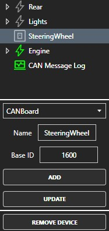

{ width="187" }

The DeviceTree is divided into 2 sections:

* `DeviceTree`

* `Device Management`

## DeviceTree

### Icons

Each device type has a different icon in the DeviceTree. 

When the device is detected the icon change from gray to green. 

| Device Type | Icon                                  |
| ----------- | ------------------------------------- |
| dingoPDM    |       |
| CANBoard    |  |
| CANMsgLog   |      |

!!! Note
    Devices are considered detected when CAN messages are received in their ID range based on the `Base ID`

### Device Order

The order of devices in the DeviceTree is based on the `Base ID`.

The lowest `Base ID` are shown at the top. 

`CANMsgLog` always has a `Base ID` value of `9999`, making sure it is always at the bottom.

## Device Management

### Type

Select the `Type` of device to add. 

### Name

Set or edit the `Name` of the device in the DeviceTree.

### Base ID

Set or edit the `Base ID` of the device. 

!!! Info
    Currently `Base ID` must be within the 11 bit range of the standard CAN ID (0-2048)

### Add

`Add` a new device to the DeviceTree with the `Name` and `Base ID` as set.

### Update

`Update` the `Name` and/or `Base ID` values of the selected device in the DeviceTree.

### Remove

`Remove` the selected device from the DeviceTree. 